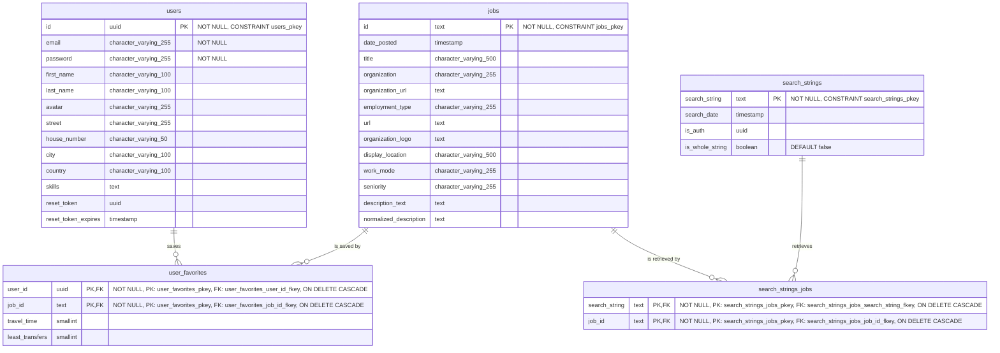

# Entity Relationship Diagram (ERD)

This diagram illustrates the current database architecture for the JobCompass application. See [`create_tables.sql`](../db_migrations/create_tables.sql) for the SQL implementation of this schema.

## Database Schema Overview

The JobCompass database consists of 5 main tables that support user management, job searching, and personalization features:

- **users** - User accounts and profile information
- **jobs** - Job listings fetched from external APIs
- **user_favorites** - Many-to-many relationship between users and saved jobs
- **search_strings** - Search query tracking with authentication context
- **search_strings_jobs** - Many-to-many relationship linking searches to resulting jobs

## Detailed Table Descriptions

### users Table

Stores user authentication and profile data:

- **Primary Key**: UUID-based unique identifier
- **Authentication**: Email and password (bcrypt hashed)
- **Profile**: Name, avatar, location details
- **Skills**: Text field for user skills and qualifications
- **Password Reset**: Token-based password recovery system

### jobs Table

Central repository for all job listings:

- **Job Identification**: Text-based ID from external APIs
- **Company Information**: Organization details, logos, and URLs
- **Job Details**: Title, description, employment type, seniority
- **Location**: Display location and work mode (remote/on-site)
- **Search Optimization**: Normalized description for better matching

### user_favorites Table

Links users to their saved jobs with commute data:

- **Composite Key**: User ID + Job ID combination
- **Commute Data**: Travel time and transfer calculations
- **Cascade Delete**: Automatic cleanup when users or jobs are removed

### search_strings Table

Tracks all search queries for caching and analytics:

- **Search Context**: The actual search string used
- **Authentication Context**: UUID of user who made the search (null for guests)
- **Timestamp**: When the search was performed
- **Whole String Flag**: Boolean indicating if search should match whole string only (defaults to false)
- **Cache Key**: Used for efficient result retrieval

### search_strings_jobs Table

Many-to-many relationship between searches and resulting jobs:

- **Linkage**: Connects search queries to specific job results
- **Cache Foundation**: Enables efficient result retrieval for repeated searches
- **Analytics**: Supports search result analysis and optimization
