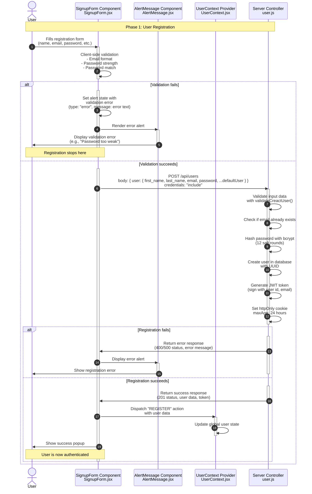

**Phase 1: User Registration**

- [← Back to Authentication Flowchart](_AuthenticationFlowchart.md)
- [Previous] - (This is the first phase)
- [Next → Phase 2: User Login](2.User%20Login.md)

## Key Components & Files

### Client Side

- **SignupForm.jsx** (`client/src/pages/SignupForm.jsx`)
  - Handles form input and validation
  - Password strength requirements display
  - Real-time validation feedback
  - GDPR compliance notice

- **UserContext.jsx** (`client/src/context/UserContext.jsx`)
  - Global authentication state management
  - User data persistence across app

- **AlertMessage Component** (`client/src/components/AlertMessage/AlertMessage.jsx`)
  - Displays validation and error messages
  - Handles success notifications

### Server Side

- **createUser** (`server/src/controllers/user.js`)
  - Input validation with `validateCreactUser()`
  - Email uniqueness check
  - Password hashing with bcrypt
  - JWT token generation
  - Database user creation

- **Rate Limiting** (`server/src/middleware/rateLimiter.js`)
  - 5 requests per 5 minutes window
  - Prevents brute force registration attacks

- **Authentication Middleware** (`server/src/middleware/authVerify.js`)
  - JWT token verification
  - User authentication for protected routes

## Security Features

- **Password Requirements**: Minimum 8 characters, uppercase, lowercase, numbers, symbols
- **Email Validation**: Format checking and uniqueness verification
- **Password Hashing**: bcrypt with 12 salt rounds
- **Rate Limiting**: Prevents automated registration attacks
- **JWT Tokens**: Secure authentication tokens with expiration
- **HttpOnly Cookies**: Prevents XSS token theft

## Error Handling

- **400 Bad Request**: Validation errors, duplicate email
- **500 Internal Server**: Database connection errors
- **503 Service Unavailable**: Database connection failure
