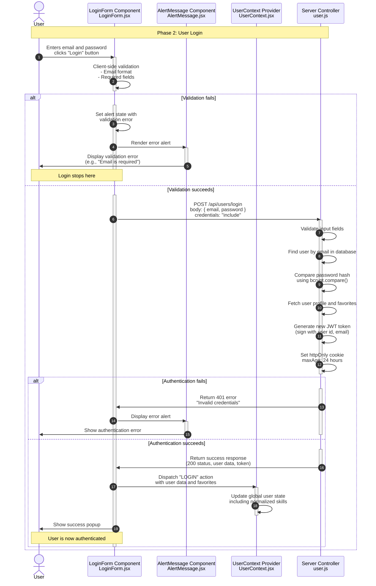

**Phase 2: User Login**

- [← Back to Authentication Flowchart](_AuthenticationFlowchart.md)
- [← Previous: Phase 1: User Registration](1.User%20Registration.md)
- [Next → Phase 3: Token Verification](3.Token%20Verification.md)



## Key Components & Files

### Client Side

- **LoginForm.jsx** (`client/src/pages/LoginForm.jsx`)
  - Email and password input handling
  - Password visibility toggle
  - Loading states and error handling
  - Links to signup and forgot password

- **UserContext.jsx** (`client/src/context/UserContext.jsx`)
  - Updates global authentication state
  - Normalizes user skills and favorites
  - Persists user session across app

### Server Side

- **loginUser** (`server/src/controllers/user.js`)
  - Input validation for email and password
  - User lookup by email
  - Password verification with bcrypt
  - JWT token generation and cookie setting
  - User profile and favorites retrieval

- **Rate Limiting** (`server/src/middleware/rateLimiter.js`)
  - 5 login attempts per 5 minutes
  - Prevents brute force attacks

## Security Features

- **Password Verification**: Secure bcrypt comparison
- **JWT Generation**: Fresh token on each login
- **HttpOnly Cookies**: Prevents XSS token theft
- **Rate Limiting**: Thwarts brute force login attempts
- **Credential Validation**: Both client and server-side validation

## User Data Structure

The login response includes:

```javascript
{
  id: string,
  email: string,
  first_name: string,
  last_name: string,
  avatar: string | null,
  street: string | null,
  house_number: string | null,
  city: string | null,
  country: string | null,
  skills: string[],
  favorites: Job[]
}
```

## Error Handling

- **400 Bad Request**: Missing email or password
- **401 Unauthorized**: Invalid credentials
- **500 Internal Server**: Database errors
- **503 Service Unavailable**: Database connection failure

## Session Management

- **Token Storage**: HttpOnly cookie with 24-hour expiration
- **Automatic Renewal**: New token issued on each login
- **Secure Transmission**: Credentials sent over HTTPS (in production)
