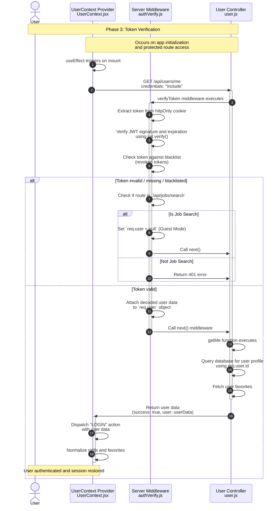

**Phase 3: Token Verification**

- [← Back to Authentication Flowchart](_AuthenticationFlowchart.md)
- [← Previous: Phase 2: User Login](2.User%20Login.md)
- [Next → Phase 4: Protected Routes](4.Protected%20Routes.md)



## Key Components & Files

### Client Side

- **UserContext.jsx** (`client/src/context/UserContext.jsx`)
  - Automatic token verification on app mount
  - Session restoration from stored cookies
  - Global authentication state management

### Server Side

- **verifyToken** (`server/src/middleware/authVerify.js`)
  - JWT token verification middleware
  - Token blacklist checking
  - User data attachment to request object

- **getMe** (`server/src/controllers/user.js`)
  - Current user profile retrieval
  - User favorites fetching
  - Complete user data assembly

## Token Verification Process

### 1. Token Extraction

- Extracts JWT from httpOnly cookie
- Handles missing token scenarios

### 2. JWT Verification

- Verifies token signature using JWT_SECRET
- Checks token expiration
- Validates token structure

### 3. Blacklist Check

- Checks token against in-memory blacklist
- Prevents access with revoked tokens
- Handles logout scenarios

### 4. User Data Retrieval

- Uses decoded user ID from token (`req.user.id`)
- Queries database for complete user profile
- Includes user favorites and preferences

## Security Features

- **JWT Verification**: Cryptographic signature validation
- **Token Expiration**: Automatic session timeout
- **Blacklist Mechanism**: Immediate token revocation on logout
- **HttpOnly Cookies**: Prevents client-side token access
- **Secure Middleware**: Centralized authentication logic

## Error Handling

- **401 Unauthorized**: No token, invalid token, expired token, blacklisted token
- **500 Internal Server**: Database connection errors
- **Silent Failures**: Graceful handling of expected "No token provided" for guests

## Token Blacklist

- **Storage**: In-memory array of revoked tokens
- **Addition**: Tokens added on logout
- **Persistence**: Lost on server restart (acceptable for current implementation)
- **Performance**: O(n) lookup, suitable for moderate user counts

## User Data Structure

The verification response includes complete user profile:

```javascript
{
  id: string,
  email: string,
  first_name: string,
  last_name: string,
  avatar: string | null,
  street: string | null,
  house_number: string | null,
  city: string | null,
  country: string | null,
  skills: string[],
  favorites: Job[]
}
```
