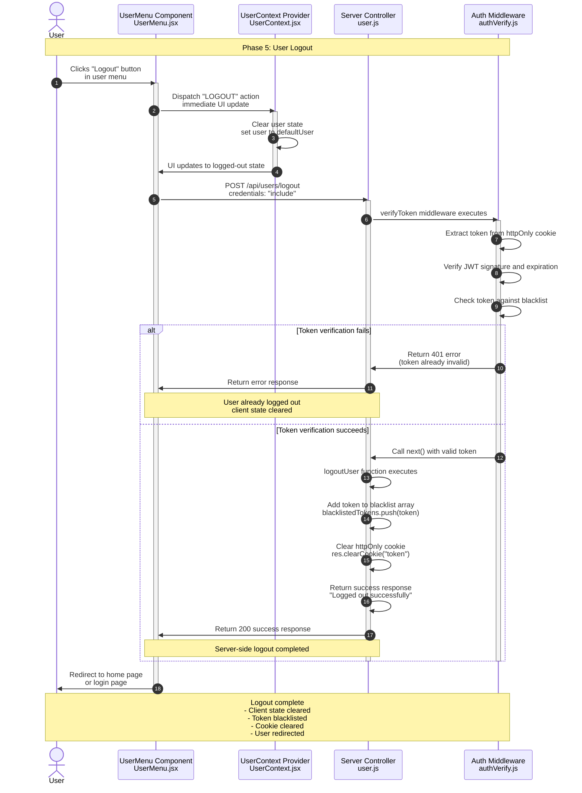

**Phase 5: User Logout**

- [← Back to Authentication Flowchart](_AuthenticationFlowchart.md)
- [← Previous: Phase 4: Protected Routes](4.Protected%20Routes.md)
- [Next → Phase 6: Password Reset](6.Password%20Reset.md)



## Key Components & Files

### Client Side

- **UserMenu.jsx** (`client/src/components/UserMenu.jsx`)
  - Logout button and menu handling
  - Immediate UI state updates
  - User redirection after logout

- **UserContext.jsx** (`client/src/context/UserContext.jsx`)
  - Global authentication state management
  - Immediate state clearing on logout
  - Session cleanup

### Server Side

- **logoutUser** (`server/src/controllers/user.js`)
  - Token blacklisting logic
  - Cookie clearing
  - Logout response handling

- **verifyToken** (`server/src/middleware/authVerify.js`)
  - Token validation before logout
  - Blacklist checking
  - Middleware chain execution

## Logout Process

### 1. Client-Side Logout

- Immediate UI state update for better UX
- User context cleared to default state
- Visual feedback showing logged-out status

### 2. Server-Side Logout

- Token added to in-memory blacklist
- HttpOnly cookie cleared from browser
- Success response sent to client

### 3. Session Invalidation

- Blacklisted tokens rejected in future requests
- Cookie removal prevents automatic token sending
- Complete session termination

## Security Features

### Token Blacklisting

```javascript
// Token added to blacklist array
blacklistedTokens.push(token);
```

### Cookie Clearing

```javascript
// HttpOnly cookie removal
res.clearCookie("token");
```

### Immediate State Clearing

- Client state cleared immediately for better UX
- Server-side validation ensures security
- Prevents access with invalidated tokens

## Error Handling

- **400 Bad Request**: No token provided in request
- **401 Unauthorized**: Invalid or expired token
- **500 Internal Server**: Logout processing errors
- **Graceful Handling**: Client logout continues even if server fails

## Blacklist Management

### Storage

- **In-memory array**: `blacklistedTokens` in authVerify.js
- **Runtime persistence**: Valid until server restart
- **Performance**: O(n) lookup for token validation

### Limitations

- **Server Restart**: Blacklist cleared on restart
- **Memory Usage**: Grows with logout count
- **Scalability**: Not suitable for massive user bases

### Alternatives (Future Considerations)

- **Redis Storage**: Persistent blacklist with TTL
- **Database Storage**: Persistent token revocation
- **JWT Claims**: Include logout timestamp in token validation

## User Experience Flow

### 1. Logout Initiation

- User clicks logout in user menu
- Immediate visual feedback

### 2. State Updates

- UI updates to logged-out state
- User context cleared
- Navigation redirects

### 3. Server Communication

- Logout request sent to server
- Token blacklisted and cookie cleared
- Success response received

### 4. Session Termination

- Future requests rejected with blacklisted token
- User must login again for access
- Complete session invalidation

## Security Considerations

### Immediate Client Response

- Provides better user experience
- Reduces perceived latency
- Works even if server is unavailable

### Server-Side Validation

- Ensures token is actually invalidated
- Prevents client-side bypass attempts
- Maintains security guarantees

### Complete Session Cleanup

- Both client and server state cleared
- No residual authentication data
- Fresh login required for future access
