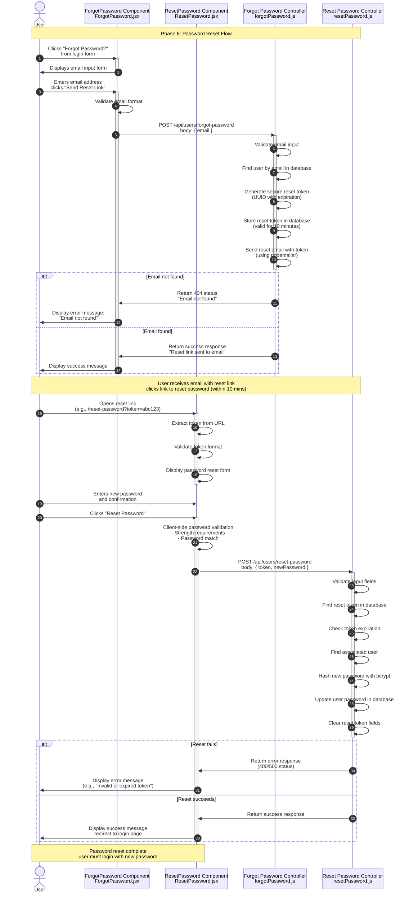

**Phase 6: Password Reset**

- [← Back to Authentication Flowchart](_AuthenticationFlowchart.md)
- [← Previous: Phase 5: User Logout](5.User%20Logout.md)
- [Next → Phase 7: Account Management](7.Account%20Management.md)



## Key Components & Files

### Client Side

- **ForgotPassword.jsx** (`client/src/pages/ForgotPassword.jsx`)
  - Email input form for reset request
  - Client-side email validation
  - Success/error message display

- **ResetPassword.jsx** (`client/src/pages/ResetPassword.jsx`)
  - Password reset form with token
  - New password validation
  - Password confirmation and strength checking

### Server Side

- **forgotPassword** (`server/src/controllers/forgotPassword.js`)
  - Email validation and user lookup
  - Reset token generation and storage
  - Email sending (implementation dependent)

- **resetPassword** (`server/src/controllers/resetPassword.js`)
  - Token validation and expiration checking
  - Password hashing and update
  - Token cleanup after use

## Security Features

### Reset Token Security

- **UUID Generation**: Cryptographically secure tokens
- **Expiration Time**: Limited validity period (typically 1-24 hours)
- **One-Time Use**: Tokens deleted after successful reset
- **Database Storage**: Secure token storage with user association

### Email Security

- **Generic Responses**: Don't reveal email existence
- **Secure Links**: HTTPS-only reset links
- **Token Validation**: Server-side token verification

### Password Security

- **Strength Requirements**: Same as registration
- **Bcrypt Hashing**: Secure password storage
- **Session Invalidation**: Optional logout of all sessions

## Reset Token Structure

```javascript
// Database storage example
{
  token: "uuid-v4-token",
  user_id: "user-uuid",
  expires_at: "2024-01-01T12:00:00Z",
  created_at: "2024-01-01T11:00:00Z"
}
```

## Error Handling

### Forgot Password Errors

- **400 Bad Request**: Invalid email format
- **500 Internal Server**: Database or email service errors
- **Generic Success**: Always return success for security

### Reset Password Errors

- **400 Bad Request**: Invalid token, weak password
- **404 Not Found**: Token not found or expired
- **500 Internal Server**: Database errors during update

## User Experience Flow

### 1. Reset Request

- User initiates from login page
- Email form with validation
- Success message regardless of email existence

### 2. Email Delivery

- Reset email with secure link
- Token embedded in URL parameters
- Clear expiration information

### 3. Password Reset

- Token validation on page load
- Password strength requirements
- Confirmation and success redirect

### 4. Completion

- Redirect to login page
- Message instructing to use new password
- All previous sessions invalidated

## Security Considerations

### Information Disclosure

- Generic responses prevent email enumeration
- Error messages don't reveal system details
- Token format doesn't expose user information

### Token Security

- Cryptographically secure random tokens
- Limited lifetime prevents long-term abuse
- One-time use prevents replay attacks

### Password Security

- Same strength requirements as registration
- Secure hashing with bcrypt
- Optional session invalidation

## Implementation Notes

### Email Service

- Email sending implementation varies
- Consider using transactional email services
- Handle email delivery failures gracefully

### Token Cleanup

- Implement cleanup for expired tokens
- Consider background job for maintenance
- Monitor token usage patterns

### Rate Limiting

- Apply rate limiting to reset requests
- Prevent email bombing attacks
- Limit per-email and per-IP requests
