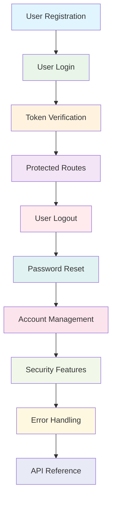

# Authentication Flowchart

This document provides a comprehensive overview of the authentication system in the JobCompass application. The authentication flow is divided into 10 phases, each documented in detail with sequence diagrams and implementation details.

## Authentication Flow Overview

## Phase Navigation

### 1. [User Registration](1.User%20Registration.md)

**Purpose**: Create new user accounts with secure password storage

**Key Components**:

- Client-side validation and password requirements
- Server-side input validation and email uniqueness check
- Bcrypt password hashing with 12 salt rounds
- JWT token generation and httpOnly cookie setting
- Rate limiting to prevent abuse

**Security Features**:

- Password strength requirements (8+ chars, uppercase, lowercase, numbers, symbols)
- Email format validation and uniqueness verification
- CSRF protection via SameSite cookies
- Rate limiting (5 requests per 5 minutes)

---

### 2. [User Login](2.User%20Login.md)

**Purpose**: Authenticate existing users and establish sessions

**Key Components**:

- Email and password validation
- Secure password comparison with bcrypt
- User profile and favorites retrieval
- Fresh JWT token generation
- Session establishment with httpOnly cookies

**Security Features**:

- Secure password verification
- Rate limiting for brute force protection
- Automatic token refresh on login
- Complete user data retrieval

---

### 3. [Token Verification](3.Token%20Verification.md)

**Purpose**: Validate authentication tokens on each protected request

**Key Components**:

- JWT token extraction from httpOnly cookies
- Cryptographic signature verification
- Token expiration checking
- Blacklist validation for revoked tokens
- User data attachment to request objects

**Security Features**:

- Cryptographic JWT verification
- Token blacklist for immediate revocation
- Automatic session timeout
- Secure middleware chain

---

### 4. [Protected Routes](4.Protected%20Routes.md)

**Purpose**: Control access to authenticated resources

**Key Components**:

- Client-side route protection with UserContext
- Server-side middleware verification
- Automatic redirect for unauthenticated users
- Protected API endpoint access

**Security Features**:

- Dual protection (client + server)
- Automatic logout on authentication failures
- Secure middleware chain
- Graceful error handling

---

### 5. [User Logout](5.User%20Logout.md)

**Purpose**: Securely terminate user sessions

**Key Components**:

- Immediate client-side state clearing
- Server-side token blacklisting
- HttpOnly cookie removal
- Session invalidation

**Security Features**:

- Immediate token revocation
- Complete session cleanup
- Secure cookie handling
- Prevents session hijacking

---

### 6. [Password Reset](6.Password%20Reset.md)

**Purpose**: Allow users to reset forgotten passwords securely

**Key Components**:

- Secure reset token generation
- Email delivery with reset links
- Token validation and expiration
- Password update with security measures

**Security Features**:

- Cryptographically secure reset tokens
- Token expiration (typically 1-24 hours)
- One-time use tokens
- Generic responses to prevent email enumeration

---

### 7. [Account Management](7.Account%20Management.md)

**Purpose**: Manage user profiles and account settings

**Key Components**:

- Profile information updates
- Skills preference management
- Password changes with verification
- Account deletion with confirmation

**Security Features**:

- Current password verification for sensitive changes
- Input validation and sanitization
- Secure data handling
- GDPR compliance for data deletion

---

### 8. [Security Features](8.Security%20Features.md)

**Purpose**: Comprehensive security measures and threat mitigation

**Key Components**:

- Rate limiting and abuse prevention
- JWT token security
- HttpOnly cookie protection
- Input validation and sanitization

**Security Features**:

- Brute force attack prevention
- XSS protection via httpOnly cookies
- CSRF protection via SameSite cookies
- SQL injection prevention via parameterized queries

---

### 9. [Error Handling](9.Error%20Handling.md)

**Purpose**: Comprehensive error management and user experience

**Key Components**:

- Client-side validation feedback
- Server-side error responses
- Authentication error recovery
- Network error handling

**Error Types**:

- Validation errors (400)
- Authentication errors (401)
- Rate limit errors (429)
- Server errors (500/503)

---

### 10. [API Reference](10.API%20Reference.md)

**Purpose**: Complete API documentation for all authentication endpoints

**Endpoints Covered**:

- User registration and login
- Profile and account management
- Password reset functionality
- Security and utility endpoints

**Documentation Includes**:

- Request/response formats
- Authentication requirements
- Error responses
- Rate limiting information

---

## Technology Stack

### Frontend (Client)

- **React**: User interface components
- **Context API**: Global authentication state (UserContext)
- **fetch / useFetch hook**: HTTP client for API requests (with /api prefix)
- **React Router**: Protected route handling

### Backend (Server)

- **Node.js**: Server runtime
- **Express.js**: Web framework
- **JWT**: Authentication tokens
- **Bcrypt**: Password hashing
- **PostgreSQL**: User data storage

### Security

- **JWT**: Stateless authentication
- **Bcrypt**: Secure password storage
- **HttpOnly Cookies**: Prevent XSS token theft
- **Rate Limiting**: Prevent brute force attacks
- **CORS**: Cross-origin request security

---

## Authentication Flow Summary

### Registration Flow

1. User submits registration form
2. Client validates input (password strength, email format)
3. Server validates and checks email uniqueness
4. Password hashed with bcrypt
5. User created in database
6. JWT token generated and stored in httpOnly cookie
7. User logged in automatically

### Login Flow

1. User submits credentials
2. Server validates input
3. Password compared with bcrypt hash
4. User profile and favorites retrieved
5. New JWT token generated
6. Token stored in httpOnly cookie
7. User session established

### Session Management

1. Token verified on each protected request
2. JWT signature and expiration validated
3. Token checked against blacklist
4. User data attached to request
5. Protected resources accessed

### Logout Flow

1. User requests logout
2. Client state cleared immediately
3. Token added to blacklist
4. HttpOnly cookie cleared
5. Session terminated

---

## Security Best Practices Implemented

### Password Security

- Minimum 8 characters with complexity requirements
- Bcrypt hashing with 12 salt rounds
- Secure password change workflow
- Current password verification for sensitive operations

### Token Security

- JWT tokens with cryptographic signing
- HttpOnly cookies prevent XSS access
- 24-hour token expiration
- Immediate token revocation on logout

### Input Validation

- Server-side validation for all inputs
- Type checking and sanitization
- Parameterized queries prevent SQL injection
- Rate limiting prevents abuse

### Session Management

- Secure cookie configuration
- SameSite cookie attribute
- Automatic session timeout
- Complete session cleanup on logout

---

## Monitoring and Maintenance

### Security Monitoring

- Authentication failure tracking
- Rate limit violation logging
- Suspicious activity detection
- Error pattern analysis

### Performance Monitoring

- Token verification performance
- Database query optimization
- Rate limiting effectiveness
- Error response times

### Maintenance Tasks

- Token blacklist cleanup
- Security dependency updates
- Database maintenance
- Log rotation and analysis

---

## Future Enhancements

### Security Improvements

- Multi-factor authentication (MFA)
- Biometric authentication options
- Advanced rate limiting algorithms
- Real-time threat detection

### User Experience

- Social login integration
- Progressive authentication
- Adaptive security measures
- Enhanced error recovery

### Infrastructure

- Redis for token blacklist storage
- Database replication for high availability
- Load balancing for scalability
- Enhanced monitoring and alerting

---

## Conclusion

The JobCompass authentication system provides a robust, secure, and user-friendly authentication experience. The comprehensive documentation covers all aspects of the authentication flow, from user registration to account management, with detailed security considerations and error handling strategies.

The system follows industry best practices for security and user experience, including:

- Secure password storage and verification
- JWT-based stateless authentication
- Comprehensive input validation
- Rate limiting and abuse prevention
- Graceful error handling and recovery

This documentation serves as a complete reference for developers working with the authentication system, providing both high-level overviews and detailed implementation specifics.
