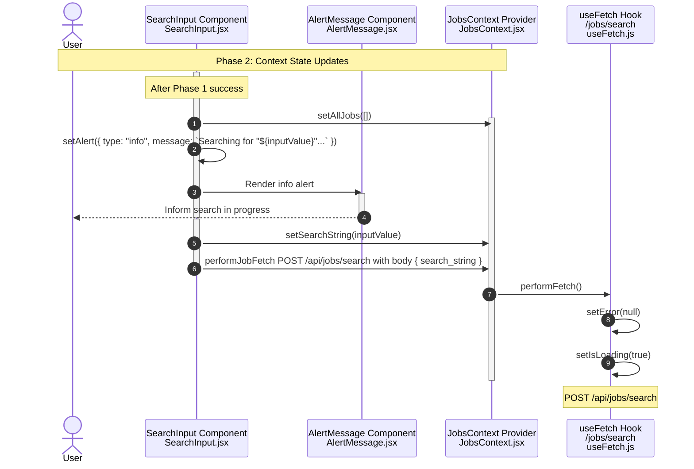

**Phase 2: Context State Updates**

- [← Back to Job Fetch Flowchart](_JobFetchFlowchart.md)
- [← Previous: Phase 1: Initial Setup & Input Validation](1.Initial%20Setup%20&%20Input%20Validation.md)
- [Next → Phase 3: Navigation](3.Navigation.md)

