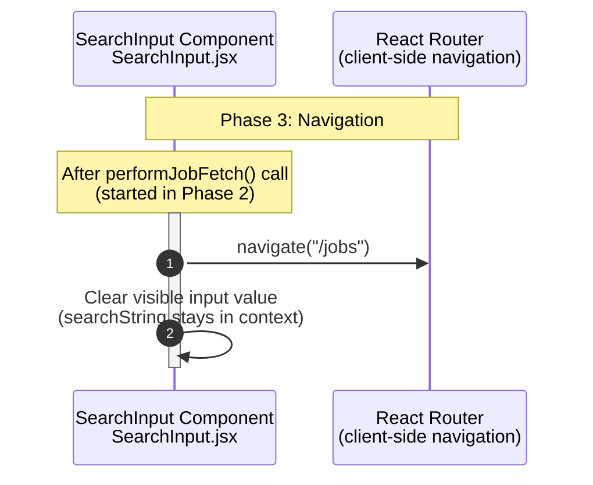

**Phase 3: Navigation**

- [← Back to Job Fetch Flowchart](_JobFetchFlowchart.md)
- [← Previous: Phase 2: Context State Updates](2.Context%20State%20Updates.md)
- [Next → Phase 4.1: Request Validation & Initiation](4.1.Request%20Validation%20&%20Initiation.md)

