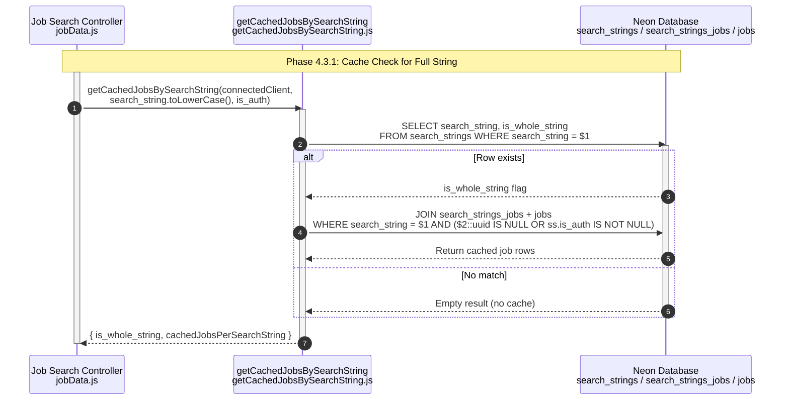

**Phase 4.3.1: Cache Check for Full String**

- [← Back to Job Fetch Flowchart](_JobFetchFlowchart.md)
- [← Previous: Phase 4.1: Request Validation & Initiation](4.1.Request%20Validation%20&%20Initiation.md)
- [Next → Phase 4.3.2: Full Search String Cached](4.3.2.Full%20Search%20String%20Cached.md)
- [Alternative → Phase 4.3.3: Not Cached for Full String](4.3.3.Not%20Cached%20for%20Full%20String.md)

