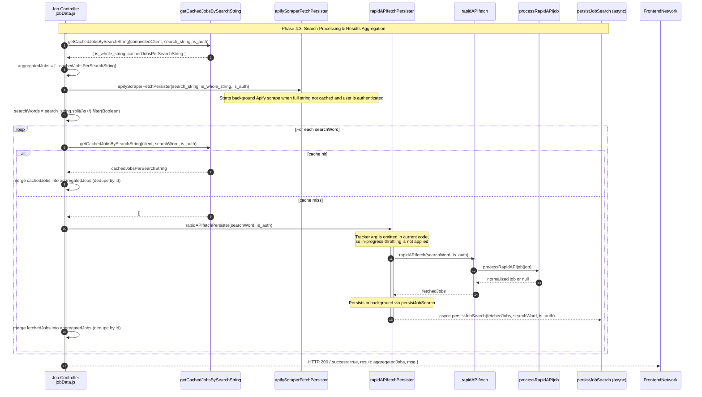

**Phase 4.3: Search Processing & Results Aggregation**

- [← Back to Job Fetch Flowchart](_JobFetchFlowchart.md)
- [← Previous: Phase 4.1: Request Validation & Initiation](4.1.Request%20Validation%20&%20Initiation.md)
- [Next → Phase 5.1: Database Caching Layer](5.1.Database%20Caching%20Layer.md)

## Technical Implementation Details

### Search Strategy

The system employs a multi-layered search approach:

1. **Full String Cache Check**: First attempts to find cached results for the complete search query
2. **Word-by-Word Processing**: If no full cache hit, splits the search string into individual words
3. **Parallel API Integration**: Uses both RapidAPI and LinkedIn scraper for comprehensive coverage

### API Integration Details

#### RapidAPI Integration (`rapidAPIfetch.js`)

- **Endpoint**: `linkedin-job-search-api.p.rapidapi.com/active-jb-7d`
- **Rate Limits**: 100 results for authenticated users, 5 for guests
- **Pagination**: Supports offset-based pagination
- **Location**: Defaults to "Netherlands" but configurable
- **Processing**: Uses `processRapidAPIjob()` for data normalization

#### LinkedIn Scraper (`linkedInScraperFetch.js`)

- **Service**: Apify LinkedIn Jobs Scraper
- **Polling**: 30-second intervals with 10-minute timeout
- **Company Data**: Includes company information scraping
- **Background Processing**: Runs asynchronously for authenticated users
- **Processing**: Uses `processScraperJob()` for data normalization

### Data Processing Pipeline

#### RapidAPI Job Processing (`processRapidAPIjob.js`)

- **Seniority Normalization**: Maps Dutch/German seniority levels to English
- **Work Mode Detection**: Derives remote/on-site from `remote_derived` flag
- **Location Processing**: Extracts primary location from `locations_derived`
- **Employment Type**: Normalizes employment type arrays
- **Validation**: Applies job validation rules before returning

#### LinkedIn Scraper Processing (`processScraperJob.js`)

- **Field Mapping**: Maps scraper fields to database schema
- **Description Normalization**: Combines text and HTML descriptions
- **Company Data**: Preserves company logos and URLs
- **Validation**: Ensures data quality before persistence

### Caching Strategy

- **Search String Tracking**: Records search queries with authentication context
- **Job-Search Mapping**: Many-to-many relationship between searches and resulting jobs
- **Automatic Cleanup**: Daily cron jobs remove old cache entries
- **Authentication-Based Caching**: Separate cache for authenticated vs guest users

### Deduplication Logic

- **Job ID Uniqueness**: Uses job source IDs as primary deduplication keys
- **Real-time Deduplication**: Prevents duplicate jobs during aggregation
- **Cross-Source Deduplication**: Handles jobs from multiple API sources

### Error Handling

- **API Failures**: Graceful degradation when external APIs fail
- **Database Errors**: Proper connection management and cleanup
- **Timeout Handling**: Configurable timeouts for long-running operations
- **Logging**: Comprehensive error logging for debugging
