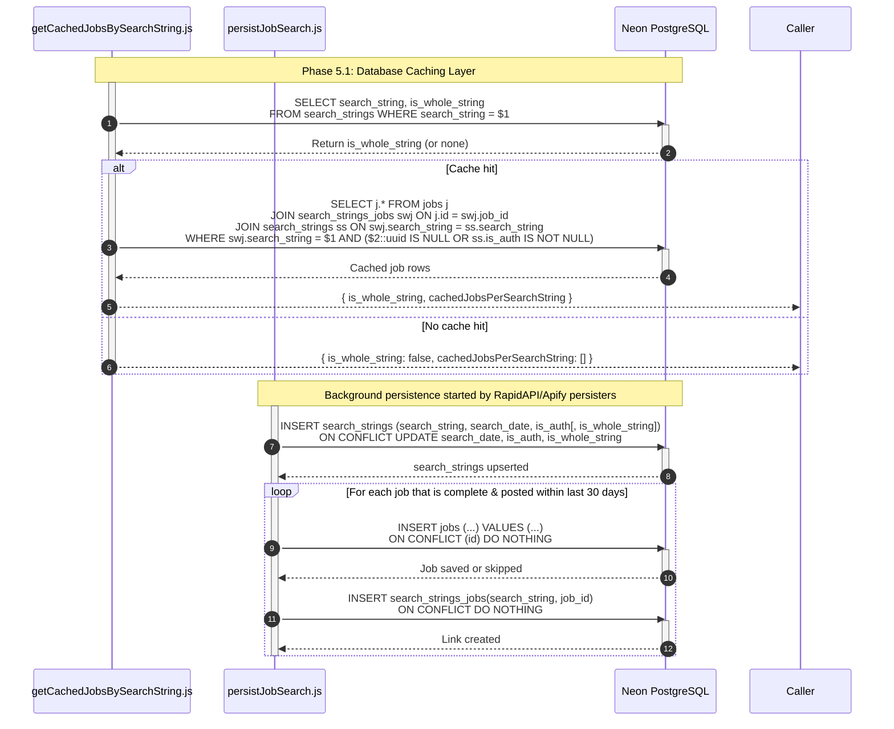

**Phase 5.1: Database Caching Layer**

- [← Back to Job Fetch Flowchart](_JobFetchFlowchart.md)
- [← Previous: Phase 4.3: Search Processing & Results Aggregation](4.3.Search%20Processing%20&%20Results%20Aggregation.md)
- [Next → Phase 6: Response Delivery](6.Response%20Delivery.md)

## Technical Implementation Details

### Database Behavior Notes

- **Auth filter**: getCachedJobsBySearchString uses `($2::uuid IS NULL OR ss.is_auth IS NOT NULL)`, so guest searches can reuse any cached string; authenticated searches read entries where `is_auth` is not null (not scoped per user).
- **Completeness check**: persistJobSearch skips jobs with null fields (except travel_time, least_transfers, work_mode) and skips posts older than 30 days.
- **is_whole_string flag**: When persisting a full-string scrape, `is_whole_string` is stored to avoid retriggering Apify for the same exact phrase.
- **Conflict handling**: Jobs and search-string links use `ON CONFLICT DO NOTHING`; search_strings updates last seen timestamp and auth flags on conflict.
