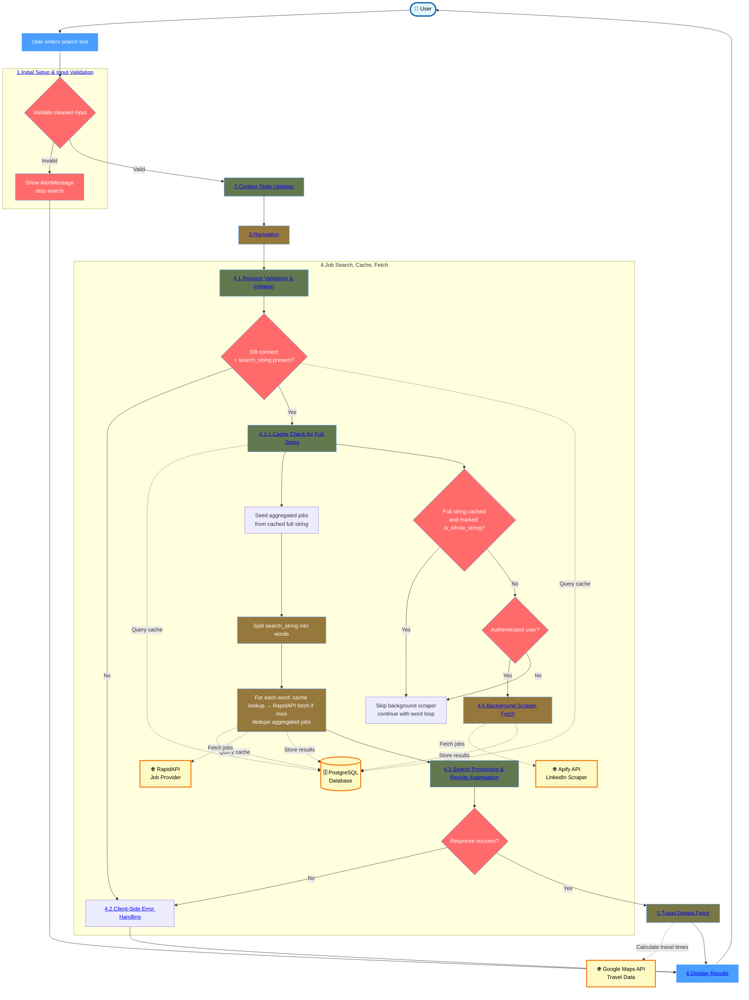

### Phase Navigation

- [1. Initial Setup & Input Validation](1.Initial%20Setup%20&%20Input%20Validation.md)
- [2. Context State Updates](2.Context%20State%20Updates.md)
- [3. Navigation](3.Navigation.md)
- [4.1. Request Validation & Initiation](4.1.Request%20Validation%20&%20Initiation.md)
- [4.2. Client-Side Error Handling](4.2.Client-Side%20Error%20Handling.md)
- [4.3.1. Cache Check for Full String](4.3.1.Cache%20Check%20for%20Full%20String.md)
- [4.3.2. Full Search String Cached](4.3.2.Full%20Search%20String%20Cached.md)
- [4.3.3. Not Cached for Full String](4.3.3.Not%20Cached%20for%20Full%20String.md)
- [4.4. Server-Network Error Handling](4.4.Server-Network%20Error%20Handling.md)
- [4.5. Background Scraper Fetch](4.5.Background%20Scraper%20Fetch.md)
- [5. Travel Details Fetch](5.Travel%20Details%20Fetch.md)
- [6. Display Results](6.Display%20Results.md)

